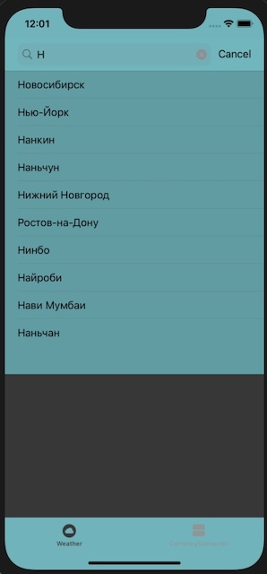
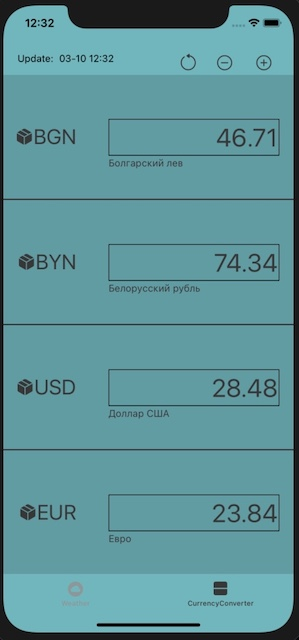

# SobesApp
Это модульное приложение создано исключительно для собеседования, демонстрируя навыки программирования для соответствующей должности.

На данный момент разработано 2 `модуля` разделенные простым Tab Bar-ом

* `Погода`  - использует 2 Api сервиса, собственно погода [openweathermap](https://openweathermap.org/) и [dadata](https://dadata.ru/) для поиска города/cтраны в SearchBar.
Все данные хранятся локально, соответственно работает и без интернета.

  

* `Конвертер валют` -  использует курсы валют [ЦБ РФ](https://www.cbr-xml-daily.ru/) стандартно доступно 2 поля, можно увеличить до 4.
Все данные так же хранятся локально, при отсутствии интернета работает с последними полученными курсами.
   

